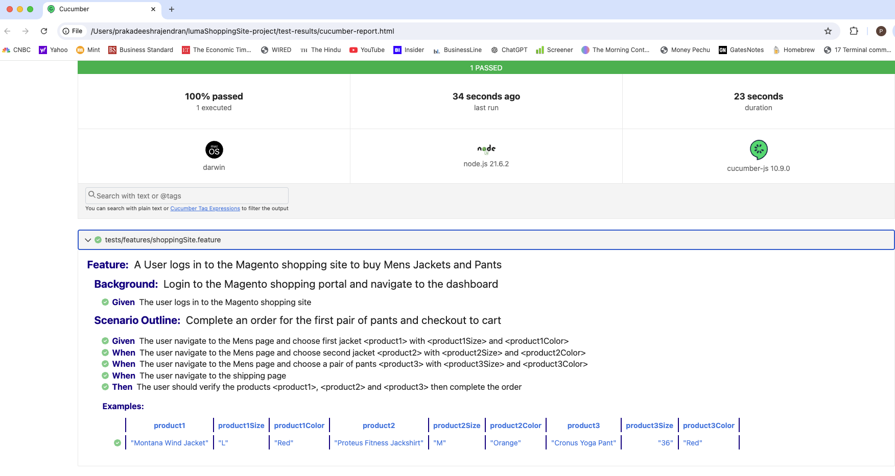
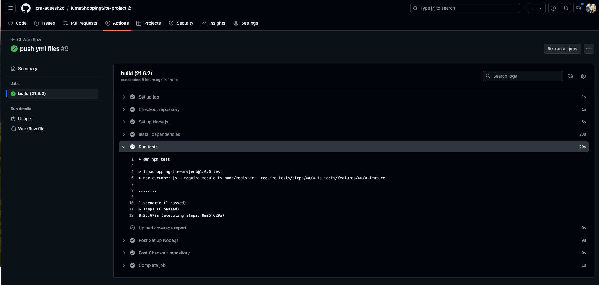

# Playwright TypeScript BDD-Cucumber Test Automation Framework

This E2E BDD Test Automation Framework in TypeScript is using (Playwright and BDD-cucumber).

* Languages: TypeScript
* Build/Dependency Management: npm
* Testing Frameworks: Playwright
* BDD Library: Cucumber
* Reporting: cucumber-html-reporter

### Pre-requisites:
* Install latest Node.JS
* Install latest Visual Studio Code
* Setup Project
* Clone the source code from git as per below command.
* git clone <https://github.com/prakadeesh26/lumaShoppingSite-project.git>
* Import the Project into Visual Studio Code
* Open Terminal and Navigate to Project Directory
* Run npx playwright install and npm install playwright @cucumber/cucumber @playwright/test typescript ts-node to download all the dependencies / libraries.
* Run npm test to run the test
* The reports folders will be created under automatically after first run.
* The HTML report generates automatically and stores in test-results/cucumber-report.html
* Run open test-results/cucumber-report.html to open the report

### Results:

* The simple Playwright TypeScript Cucumber Framework was chosen to provide a quick setup recipe and reusable solution for the users.
* Feature files are written in simple English using the npm package -cucumber-preprocessor. (Folder - tests/Features)
* The framework follows - Page Object design pattern to manage the Page Object separately, which helps with easy maintenance and code reusability. (Folder - /pages)
* The Step Definition carries a function block with an expression that links it to one or more Gherkin steps. (Folder - tests/step-definition)
* The data driven approach (JSON file - data/australiaData.json) was used to pass user data to every test case. It helps with reusability, maintainability, broader test coverage and better use of human skills.
* The Cucumber html report is a simple HTML report which helps with Test Summary and Failure reason.
